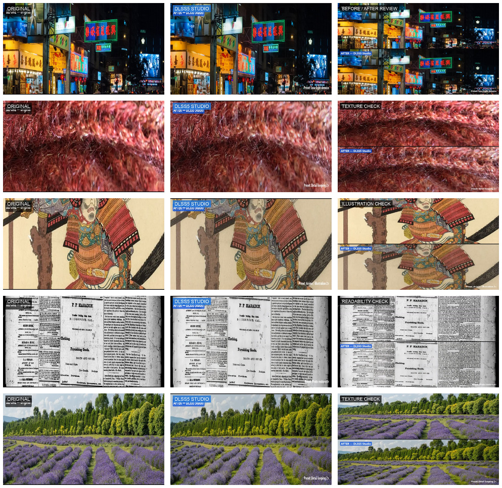

# Reddit 动图与视频素材包（2026-10-08）

这批文件用于把真实案例讲清楚，不用于规避社区审核。每条视频都来自已经记录在 `docs/marketing/dlss5-studio-brief.md` 的 Studio 对比截图：先展示原图，再展示实际输出，最后展示带有原始上下布局的前后对比板。视频只做裁切、标签和时间编排，没有重新生成、修图或替换结果。



## 已生成文件

目录：`public/marketing/reddit-motion/20261008/`

| 案例 | MP4 | GIF | 讨论角度 |
| --- | --- | --- | --- |
| Hong Kong night | `night-before-after-7s.mp4` | `night-before-after-7s.gif` | 低光噪声、霓虹边缘和文字可读性 |
| Red wool macro | `wool-before-after-7s.mp4` | `wool-before-after-7s.gif` | 细纤维是否被重建成重复纹理；需要 CC BY 署名 |
| Ukiyo-e print | `ukiyoe-before-after-7s.mp4` | `ukiyoe-before-after-7s.gif` | 插画线条、纸张纹理和 2× 输出 |
| 1880 newspaper scan | `newspaper-before-after-7s.mp4` | `newspaper-before-after-7s.gif` | 小字只能作为观察线索，不能当历史证据 |
| Lavender field | `lavender-before-after-7s.mp4` | `lavender-before-after-7s.gif` | 叶片、花朵重复纹理和边缘光晕 |

每条 MP4 为 1080×612、7.5 秒、H.264；GIF 为 480px 宽、10fps，适合信息流预览。可用下面的脚本重建：

```bash
bash scripts/build-reddit-motion.sh
```

## Reddit 发帖建议

不要把五条视频同一天发到多个社区，也不要把“宣传片”当成实测速度。每条只配一个问题、一个主要落点，并保留独立项目和来源说明。发布前仍需打开目标社区规则，确认允许自荐和外链。

### 低光夜景

```text
I ran one noisy night scene through a local Visual Enhancer workflow. The clip shows the original, the recorded output, then the full comparison board. I am checking neon edges and small signs rather than calling it “sharper” by default.

The recorded run was 3538×2318 → 7076×4636 in 26.6 s on an RTX 4090 reference machine. It is one run, not a universal benchmark. What would you inspect first: faces, signs, or thin light tubes?

Case notes: https://www.dlss5nvidia.com/marketing/reddit/dlss5-studio-kit.html?utm_source=reddit&utm_medium=community&utm_campaign=external_links_20261008&utm_content=night
```

### 纹理与毛线

```text
This is a texture check, not a “detail recovered” claim. The same wool macro is shown before, after, and as a comparison board. At 1:1, do the fibres look more consistent or merely more contrasty?

Source: “Wool” by Rosmarie Voegtli, CC BY 2.0, via Wikimedia Commons. The recorded Studio run used Detail keeping 2× and took 8.8 s on the reference machine.

Case notes: https://www.dlss5nvidia.com/marketing/reddit/dlss5-studio-kit.html?utm_source=reddit&utm_medium=community&utm_campaign=external_links_20261008&utm_content=wool
```

### 旧报纸

```text
I tested an 1880 public-domain newspaper scan with a Photo restore 4× preset. The short clip keeps the original beside the output because reconstructed letters should never be treated as historical evidence.

The recorded run was 1280×1803 → 5120×7216 in 32.4 s on one RTX 4090 machine. Which failure check matters most here: small type, paper texture, or edge halos?

Case notes: https://www.dlss5nvidia.com/marketing/reddit/dlss5-studio-kit.html?utm_source=reddit&utm_medium=community&utm_campaign=external_links_20261008&utm_content=newspaper
```

## 发布红线

- 不写 NVIDIA 官方、合作、授权、背书或官方 benchmark。
- 不写 real-time、instant、works on every GPU 或任何与其他工具的速度比较。
- 不把 DLSS neural rendering 直接称为 upscaler；神经重渲染与后续 super-resolution 是不同阶段。
- 不把 GIF/MP4 的 7.5 秒播放时长写成处理耗时；处理耗时只引用实测 brief。
- 毛线素材必须保留 CC BY 2.0 署名，其余案例按来源表标注 CC0 或公有领域。
- 不自动发帖、自动评论、批量建号或伪造用户反馈。

完整输入、输出、参数、局限和授权记录见 [materials-20261008.md](./materials-20261008.md) 与 [dlss5-studio-reddit/SOURCES.md](./dlss5-studio-reddit/SOURCES.md)。
